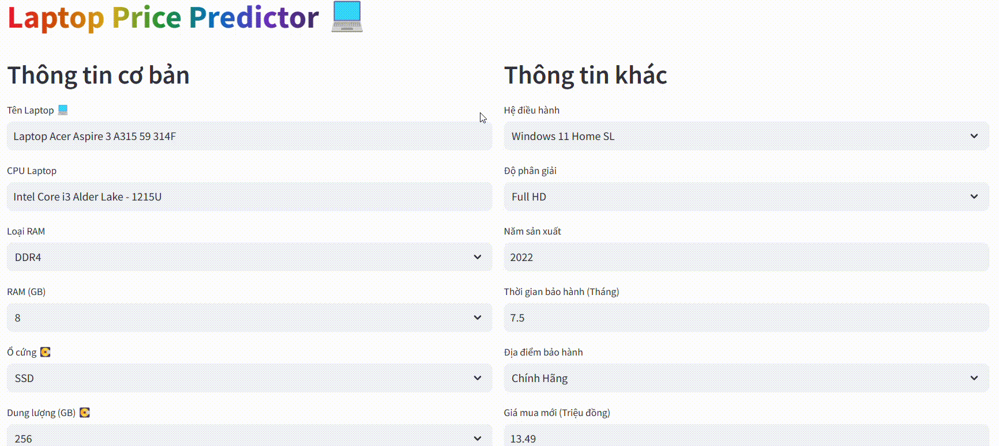

# DS105

## Installation
You need these dependencies:
```console
pip install streamlit
pip install scikit-learn
pip install scikit-learn==1.2.2
pip install selenium
pip install plotly
```

## Usage
Run
```console
streamlit run app.py
```

## Preview


## Data Preview
| Name | Laptop Type | Laptop Brand | Price | Price New | CPU | CPU Brand | Ram Size | Ram Type | Hard Drive Size | Hard Drive | Screen | Resolution | Material | OS | Year | Graphic | Graphic Name | Weight | Warranty Time | Warranty Location |
|---|:---:|:---:|:---:|:---:|:---:|:---:|---|---|---|---|---|---|---|---|---|---|---|---|---|---|
| Laptop Acer Swift 5 SF514 53T 51EX | general | Acer | 8130000 | 23990000 | Intel Core i5 Coffee Lake - 8265U | Intel | 8 | DDR4 | 256 | SSD | 14 | Full HD | Nhôm - Magie | Windows 10 Home SL | 2018 | Card tích hợp | Intel UHD Graphics 620 | 0.97 | 1 | Cửa Hàng |
| Laptop Acer Swift 3 SF314 54 51QL | general | Acer | 5520000 | 16290000 | Intel Core i5 Kabylake Refresh - 8250U | Intel | 4 | DDR4 | 1024 | HDD | 14 | Full HD | Vỏ kim loại | Windows 10 Home SL | 2018 | Card tích hợp | Intel HD Graphics 620 | 1.5 | 1 | Cửa Hàng |
| Laptop CHUWI CoreBook X | general | CHUWI | 5580000 | 15490000 | Intel Core i5 Coffee Lake - 8259U | Intel | 16 | DDR4 | 512 | SSD | 14 | 2.2K | Vỏ kim loại | Windows 10 Home SL | 2021 | Card tích hợp | Intel Iris Plus Graphics 655 | 1.5 | 1 | Cửa Hàng |
| Laptop Acer Switch 5 SW512 52P 34RS | general | Acer | 7620000 | 22490000 | Intel Core i3 Kabylake - 7130U | Intel | 4 | DDR3L | 128 | SSD | 12 | 2K | Vỏ kim loại | Windows 10 Home SL | 2019 | Card tích hợp | Intel UHD Graphics 620 | 0.92 | 1 | Cửa Hàng |
| Laptop Acer Swift 7 SF714 52T 76C6 | general | Acer | 16940000 | 49990000 | Intel Core i7 Coffee Lake - 8500Y | Intel | 16 | DDR3 | 512 | SSD | 14 | Full HD | Nhôm - Magie | Windows 10 Home SL | 2019 | Card tích hợp | Intel UHD Graphics 615 | 0.89 | 1 | Cửa Hàng |
